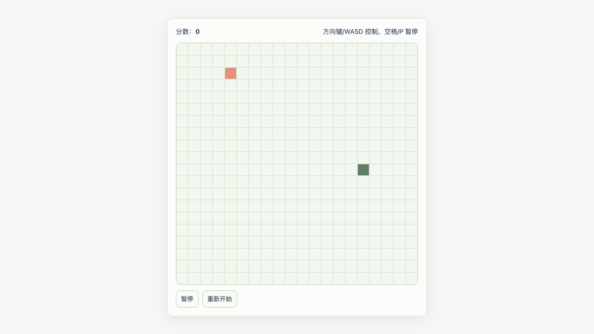
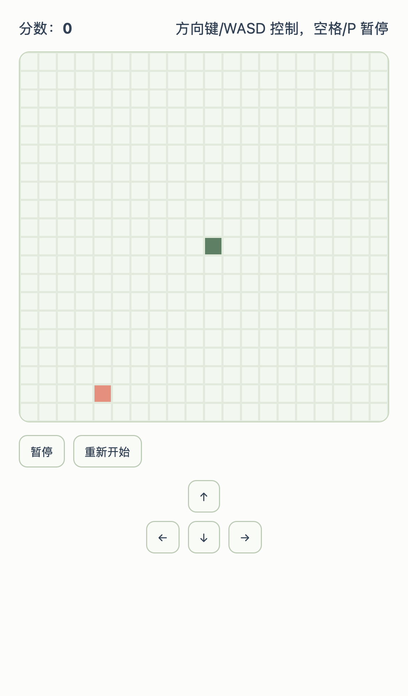

# Snake Game (Vue 3 + TypeScript)

一个可直接运行与部署的现代化贪吃蛇项目，支持多模式、特效食物、连击倍率、主题切换、成就系统、排行榜与本地统计。

## 项目亮点
- `4` 种游戏模式：`经典 / 无尽 / 障碍 / 挑战`
- 连击与倍率系统：连续吃食物可提升倍率，最高叠加并可叠双倍效果
- 特效食物：`普通 / 加速 / 减速 / 双倍`
- 关卡机制：非无尽模式每关目标 `100` 粒食物，最高 `10` 关
- `10` 套可实时切换主题（游戏进行中可切换）
- 成就系统（12项）：支持进度显示、隐藏成就、回溯解锁、本地持久化
- 本地排行榜与统计面板
- Canvas 渲染 + rAF 主循环，性能友好
- 已配置 CI（测试 + 构建）与多平台部署配置

## 在线地址
- 生产站点（Netlify）：[https://snake-yychenger-20260227.netlify.app](https://snake-yychenger-20260227.netlify.app)

## 截图



## 技术栈
- `Vue 3`
- `TypeScript`
- `Vite 7`
- `Vitest`
- `Netlify CLI`（部署辅助）

## 运行要求
- Node.js `>=20.19.0`（推荐 `22.12.0`，见 `.nvmrc`）
- npm（随 Node 安装）

## 快速开始
```bash
npm install
npm run dev
```

本地默认访问：
- [http://localhost:5173](http://localhost:5173)

## 常用命令
```bash
# 启动开发环境
npm run dev

# 类型检查 + 生产构建
npm run build

# 运行单元测试
npm test

# 预览构建产物
npm run preview
```

## 游戏玩法
### 基础操作
- 键盘方向：方向键或 `W/A/S/D`（可在设置中切换键位策略）
- 暂停/继续：`Space` 或 `P`
- 重开本关：`R`
- 新游戏：`N`
- 未开始时可按 `Enter` / `N` 开始

### 模式说明
- `经典`：标准关卡推进
- `无尽`：不自动通关，按总分动态加速
- `障碍`：带障碍物，关卡越高障碍越多
- `挑战`：更激进的速度与障碍参数

### 食物与效果
- `普通`：基础得分
- `加速果`：短时间提高移动速度
- `减速果`：短时间降低移动速度
- `双倍果`：短时间提升得分倍率

### 连击与倍率
- 连击窗口内持续吃食物可提高连击
- 连击每提升阶段提高倍率（上限控制）
- 双倍果可与连击倍率叠加

## 主题系统（10 套）
可在主界面主题条或设置面板中切换，切换后会同步更新：
- 页面背景
- 组件色彩
- Canvas 棋盘颜色（蛇、食物、障碍、网格）

内置主题：
- 雾林柔光（sage）
- 落日胶片（sunset）
- 海盐蓝湾（ocean）
- 午夜霓虹（noir）
- 牛皮纸页（paper）
- 街机像素（retro）
- 电光糖果（neon）
- 沙丘暖风（sand）
- 深林苔影（forest）
- 极昼冰川（ice）

## 成就系统（12 项）
### 特性
- 主界面独立 Achievements 区块
- 显示 `进度条 + 数字进度（x/target）`
- 隐藏成就支持“半明确提示”
- 每局最多弹 1 条解锁提示，其余进入“待查看新解锁”
- 支持回溯解锁（基于现有 analytics + leaderboard 可推导项）
- 成就可单独重置（不影响排行榜）

### 成就列表
- First Bite
- Getting Warmed Up
- Score Chaser
- Marathon Snake
- Combo Rookie
- Combo Master
- Speed Runner
- Control Specialist
- Classic Cleared
- Obstacle Ace
- Challenge Pulse（隐藏）
- Endless Spirit（隐藏）

## 本地数据存储（localStorage）
- `snake_settings_v1`：用户设置（键位、网格、速度、主题、音效）
- `snake_leaderboard_v1`：最近战绩
- `snake_analytics_v1`：本地统计
- `snake_achievements_v1`：成就进度与解锁状态

## 项目结构
```text
.
├── src/
│   ├── modules/snake/
│   │   ├── SnakeGame.vue      # 主界面与交互逻辑
│   │   ├── engine.ts          # 状态推进引擎
│   │   ├── rules.ts           # 规则层（食物、连击、速度、障碍）
│   │   ├── canvas.ts          # Canvas 渲染
│   │   ├── achievements.ts    # 成就系统
│   │   ├── themes.ts          # 主题预设
│   │   ├── leaderboard.ts     # 排行榜存储与查询
│   │   ├── analytics.ts       # 统计存储与事件
│   │   ├── settings.ts        # 设置持久化与归一化
│   │   └── index.ts           # 模块导出
│   ├── App.vue
│   ├── main.ts
│   └── styles.css
├── tests/
│   ├── snakeGame.test.ts
│   ├── achievements.test.ts
│   └── gameFlowPersistence.test.ts
├── netlify.toml
├── wrangler.toml
├── DEPLOYMENT.md
└── .github/workflows/ci.yml
```

## 测试与质量保障
- 单元测试覆盖：
  - 游戏核心逻辑（推进、碰撞、连击、关卡）
  - 成就判定与回溯
  - 数据持久化流程
- CI（GitHub Actions）自动执行：
  - `npm ci`
  - `npm test`
  - `npm run build`

## 部署
详细见 [DEPLOYMENT.md](./DEPLOYMENT.md)。

### Netlify
- 已配置 `netlify.toml`
- Build 命令：`npm run build`
- Publish 目录：`dist`
- SPA 重写：`/* -> /index.html`

### Vercel / Cloudflare Pages
- 同样使用 `npm run build`
- 输出目录：`dist`

## 已实现的关键工程优化
- 主循环从 `setTimeout` 升级为 `requestAnimationFrame + accumulator`
- Canvas 背景网格离屏缓存，减少重复绘制
- 食物落点算法优化，降低高蛇长场景开销
- 音效复用单例 `AudioContext`
- Node 版本约束与 CI 校验

## 许可证
当前仓库未声明开源许可证；如需开源，建议补充 `LICENSE` 文件（例如 MIT）。
